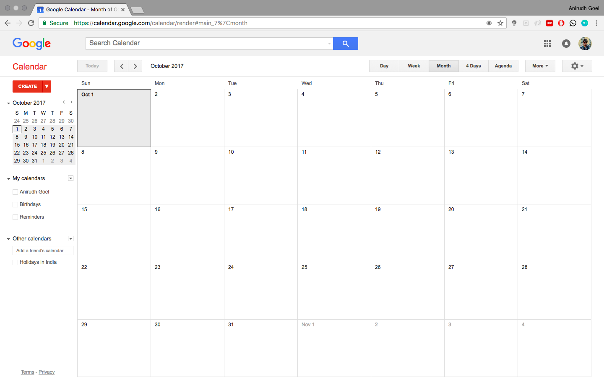

# Productive Calender

A Django based application that functions as a complete planner with features like event management, Google Calender Sync, weather details, on-screen clock, responsive design and a elegant UI.

## Motivation

Most of the calendars currently available online either have a boring UI or if they have a good UI, they don't provide much functionality. So, I built this Productive Calender, which has the following features-

- **Event Management** You can view, create, modify and delete events, all while staying on the same page.
- **Google Calender Sync** Just sign in to your Google account and all the events you create, modify or delete will be synced across both the calenders automatically.
- **Weather info** This calender automatically displays weather details, including the current temperature, minimum/maximum temperature and rainy/sunny conditions for the next few days, all on the home page.
- **Responsive Design** This was one of the major challenges that I faced during the development of this calender. As the event creation, deletion and modifying was all to be done on the same (home) page, I had to write some intelligent Javascript code to recognise the screen size and place the event (display, add, or modify) box according to the screen size.
- **Elegant UI** Along with providing all the important functionalities, this calender also has a very elegant UI. For comparison, I am adding some screenshots from my Calender and Google Calender.

## Screenshots
 

### Home Page

   
### Event addition

   
### Event viewing

   
### Multi day events are presented in different color

   
### _For comparison, this is a snap of the Google Calender. You can easily see the UI differences_

### Contact

You can [Anirudh Goel](http://anirudhgoel.me) via this [contact form](https://anirudhgoel.typeform.com/to/LUFqDL).