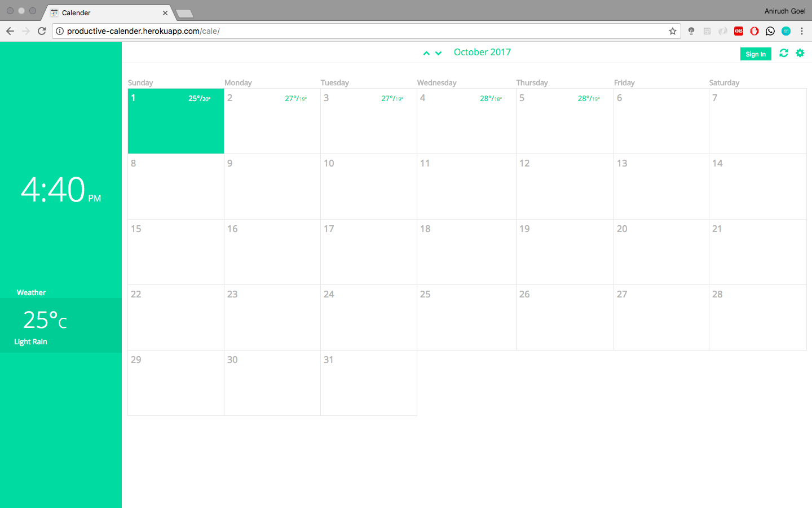
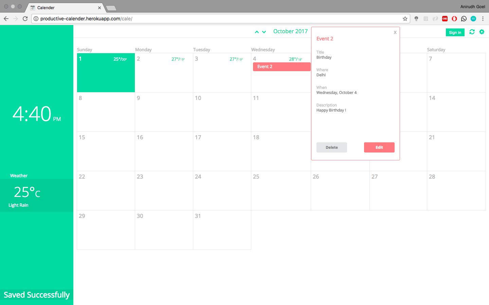
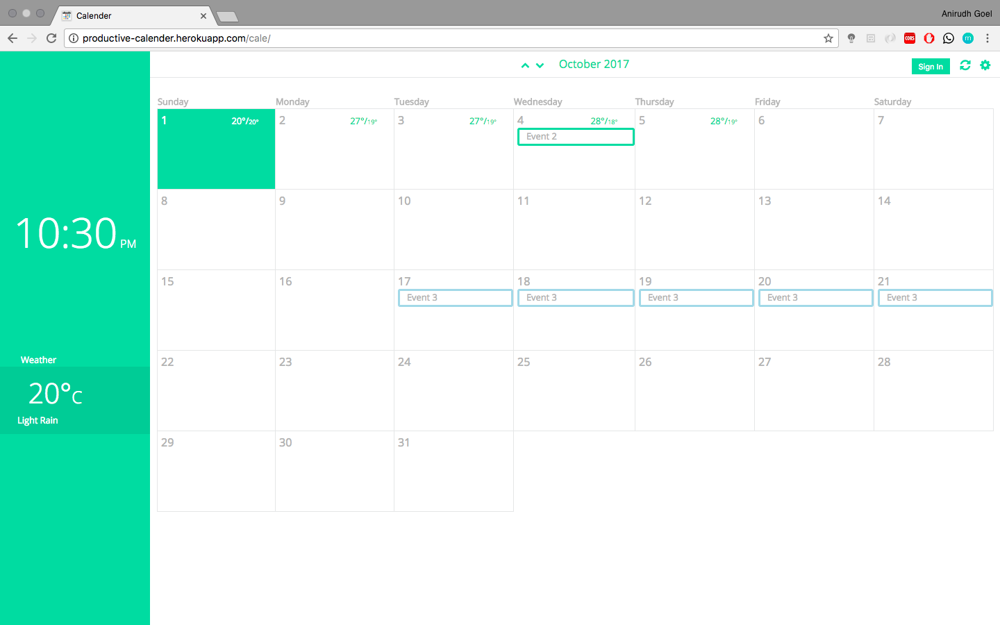

# :date:  Productive Calendar

A Django based application that functions as a complete planner with features like event management, Google Calendar Sync, weather details, on-screen clock, responsive design and a elegant UI.

## Features

- **Event Management** You can view, create, modify and delete events, all while staying on the same page.
- **Weather info** This calendar automatically displays weather details, including the current temperature, minimum/maximum temperature and rainy/sunny conditions for the current week, all on the home page.
- **Responsive Design** This was one of the major challenges that I faced during the development of this calendar. As the event creation, deletion and modifying was all to be done on the same (home) page, I had to write some intelligent Javascript code to recognise the screen size and place the event (display, add, or modify) box according to the screen size.
- **Elegant UI** Along with providing all the important functionalities, this calendar also has a very elegant UI.
- **Google Calendar Sync** Just sign in to your Google account and all the events you create, modify or delete will be synced across both the calenders automatically. This feature is disabled in the demo application as the application has no account management. To use this, please deploy a local version of the app.

## Screenshots
 

### Home Page

   
### Event addition

   
### Event viewing

   
### Multi day events (identified by different color scheme)

   

## Stargazers over time

